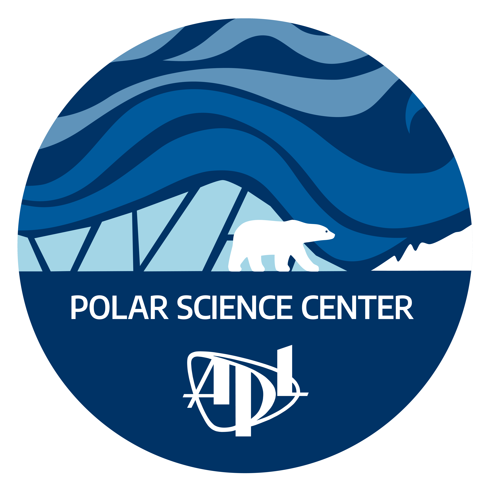

### Hi, I'm Tyler :wave:

I'm a Research Scientist and geodesist at the UW APL Polar Science Center :snowman_with_snow:

I am typically writing code in Python or making corny jokes on Slack :roll_eyes:

Ask me about NASA's [ICESat-2](https://icesat-2.gsfc.nasa.gov/) or [GRACE-FO](https://www.nasa.gov/missions/grace-fo) missions!

#### [ICESat-2 Shot Counter](./assets/XAlIAMV.jpeg)  
**Estimate:** 2181337680000 (updated 2025-10-05 02PM UTC)  
